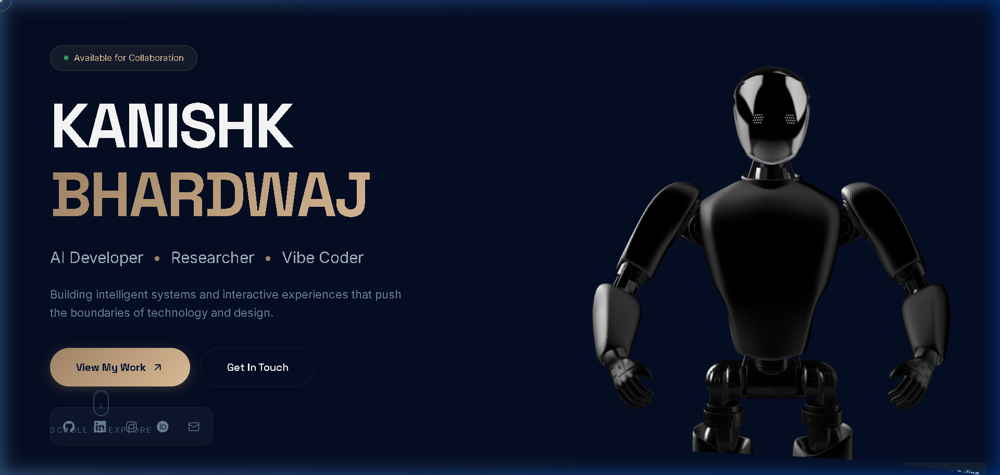
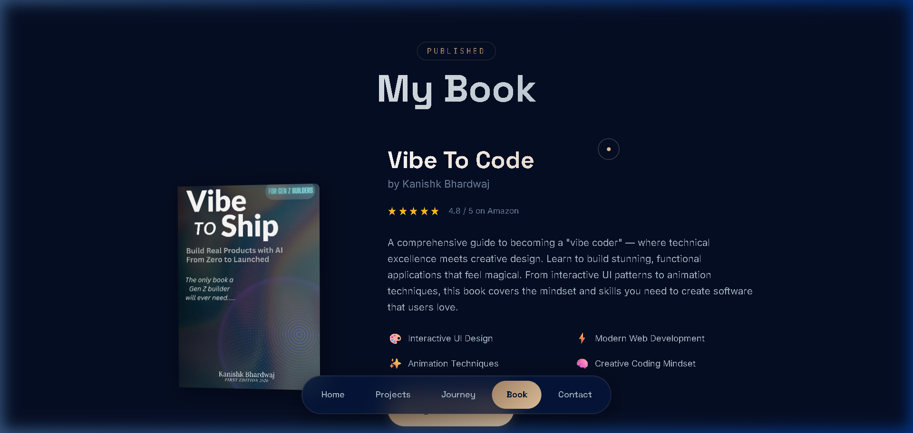
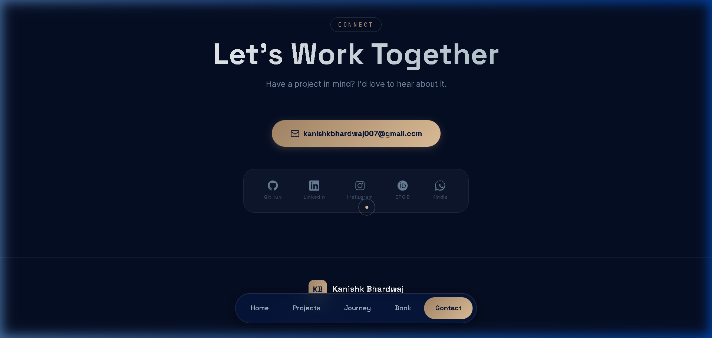

# ✧ Kanishk Bhardwaj — Interactive Portfolio ✧

<div align="center">
  
  <br>
  <p align="center">
    <b>A high-performance, cinematic 3D portfolio experience crafted with vanilla technologies.</b>
    <br>
    <i>Where technical excellence meets creative design.</i>
  </p>

  [](https://portfolio-kanishk.vercel.app)
  [](LICENSE)
  [](https://developer.mozilla.org/en-US/docs/Web/JavaScript)
</div>

---

## 🎭 Cinematic Experience

This portfolio isn't just a list of links; it's an interactive journey. Designed with 2026 aesthetics in mind, it features:

- **🍎 Apple Liquid Glass Navigation**: A frosted-glass floating bar with dynamic blur and inset glow borders.
- **🤖 3D Spline Integration**: A smooth, interactive hero robot that reacts to your scroll.
- **📖 Full 3D Rotating Book**: A custom CSS 3D book showcase with interactive 360° drag controls.
- **🌊 Fluid Curves**: Seamless section transitions using geometric clip-paths and SVG masks.

---

## 🛠️ Tech Stack & Philosophy

| Core | Animations | 3D Engine | Rendering |
| :--- | :--- | :--- | :--- |
| HTML5 / CSS4 | GSAP / ScrollTrigger | Spline | requestAnimationFrame |
| Vanilla JS ES6+ | CSS Keyframes | CSS 3D Transforms | GPU-Accelerated |

**Philosophy**: High-end visuals shouldn't require heavy frameworks. This site is built with **zero dependencies** for core logic (aside from GSAP for heavy-lifting animations) to ensure sub-second interaction times and maximum control.

---

## 📸 Guided Tour

### 01. The Hero
Split layout featuring high-luxury typography on the left and a reactive 3D robot on the right. Smooth parallax ensures the robot moves naturally as you explore.



### 02. The 3D Book
Showcasing "Vibe To Code" (or "Vibe To Ship"). The book features a state-of-the-art CSS 3D structure that supports smooth pendulum auto-rotation and interactive manual drag.



### 03. Professional Contact
A modern, capsule-style social bar containing verified links to GitHub, LinkedIn, Instagram, ORCID, and Amazon Kindle.



---

## 🚀 Getting Started

1. **Clone the repo**
   ```bash
   git clone https://github.com/Kanishk0107/Portfolio.git
   ```
2. **Launch a local server**
   You can use Live Server (VS Code) or `npx serve`:
   ```bash
   npx serve .
   ```
3. **Deploy to Vercel**
   Push to your main branch, and Vercel will auto-detect the static files for deployment.

---

## ✍️ Author

**Kanishk Bhardwaj**
*AI Developer · Researcher · Vibe Coder*

- [GitHub](https://github.com/Kanishk0107)
- [LinkedIn](https://www.linkedin.com/in/kanishk-a-bhardwaj/)

<div align="center">
  <p>Crafted with ♥ and a lot of coffee.</p>
  <p>© 2026 Kanishk Bhardwaj. All rights reserved.</p>
</div>
